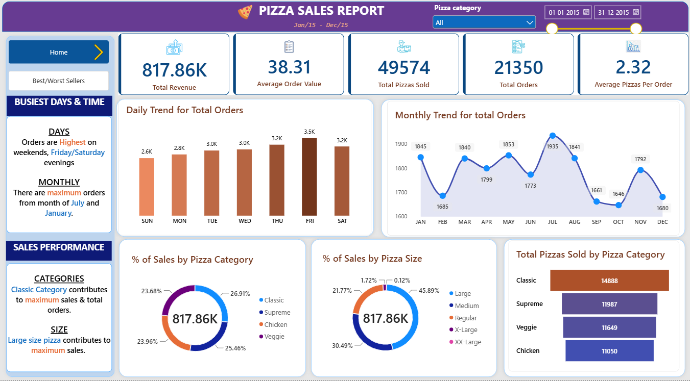

# 🍕 Pizza Sales Analysis | SQL + Power BI

An end-to-end sales analysis of a pizza restaurant's transaction data. The project answers core business questions about revenue, order behaviour, sales trends and product performance, first with **SQL (MySQL)** and then with an interactive **Power BI** dashboard built using **Power Query, DAX and measures**.

> **Project status**
> - ✅ Phase 1: SQL analysis (15 business queries) — **Completed**
> - ✅ Phase 2: Power BI dashboard (Power Query + DAX measures) — **Completed**

---

## Dashboard Preview

### Homepage


### Best & Worst Sellers


---

## 📌 Table of Contents
1. [Business Problem](#-business-problem)
2. [Dataset](#-dataset)
3. [Tools & Skills](#-tools--skills)
4. [Business Questions Answered](#-business-questions-answered)
5. [SQL Analysis & Results](#-sql-analysis--results)
6. [Key Insights](#-key-insights)
7. [Recommendations](#-recommendations)
8. [Power BI Dashboard](#-power-bi-dashboard)
9. [Repository Structure](#-repository-structure)
10. [How to Run](#-how-to-run)
11. [About Me](#-about-me)

---

## 🎯 Business Problem
A pizza restaurant records every order but has no clear view of how the business is performing. Management wants to know:

- How much revenue is the business generating, and what does a typical order look like?
- Which days and months are busiest?
- Which categories, sizes and individual pizzas drive sales, and which underperform?

This project turns raw order-line data into answers that can support decisions on staffing, menu planning and promotions.

## 🗂 Dataset
- **Table:** `pizza_sales`
- **Grain:** one row per pizza line item in an order
- **Main columns used:**

| Column | Description |
|---|---|
| `order_id` | Unique ID of an order (an order can have multiple rows) |
| `quantity` | Number of pizzas in that line item |
| `order_date` | Date of the order (stored as text, format `dd-mm-yyyy`) |
| `total_price` | Line item revenue (`quantity × unit price`) |
| `pizza_size` | S, M, L, XL, XXL |
| `pizza_category` | Classic, Veggie, Supreme, Chicken |
| `pizza_name` | Name of the pizza |

> 📝 *Add your dataset source link here (e.g., Kaggle / Maven Analytics) and the date range covered.*

## 🛠 Tools & Skills
- **MySQL / MySQL Workbench** — data analysis and querying
- **SQL concepts used:** aggregate functions, `GROUP BY`, `ORDER BY`, `LIMIT`, `DISTINCT`, subqueries, date functions (`STR_TO_DATE`, `DAYNAME`, `MONTHNAME`), `ROUND`, aliasing
- **Power BI Desktop** — Power Query (MySQL connection and data transformation), DAX measures, interactive 2-page dashboard
- **Git & GitHub** — version control and documentation

## ❓ Business Questions Answered

**KPIs**
1. What is the total revenue?
2. What is the average order value?
3. How many pizzas were sold in total?
4. How many orders were placed?
5. What is the average number of pizzas per order?

**Trends**
6. Which days of the week have the most orders?
7. Which months have the most orders?

**Sales distribution**
8. What percentage of sales comes from each pizza category?
9. What percentage of sales comes from each pizza size?

**Product performance**
10. Top 5 pizzas by revenue
11. Bottom 5 pizzas by revenue
12. Top 5 pizzas by quantity sold
13. Bottom 5 pizzas by quantity sold
14. Top 5 pizzas by number of orders
15. Bottom 5 pizzas by number of orders

## 🧮 SQL Analysis & Results

The complete script is in [`sql/pizza_sales_analysis.sql`](sql/pizza_sales_analysis.sql). The full write-up, with every query and its output screenshot, is in the PDF/DOCX under [`docs/`](docs/).

### A. KPIs

```sql
-- 1) Total Revenue
SELECT ROUND(SUM(total_price), 2) AS total_revenue FROM pizza_sales;

-- 2) Average Order Value
SELECT ROUND(SUM(total_price) / COUNT(DISTINCT order_id), 2) AS average_order_value
FROM pizza_sales;

-- 3) Total Pizzas Sold
SELECT SUM(quantity) AS total_pizzas_sold FROM pizza_sales;

-- 4) Total Orders
SELECT COUNT(DISTINCT order_id) AS total_orders FROM pizza_sales;

-- 5) Average Pizzas per Order
SELECT ROUND(SUM(quantity) / COUNT(DISTINCT order_id), 2) AS average_pizzas_per_order
FROM pizza_sales;
```

| KPI | Result |
|---|---|
| Total Revenue | **817,860.05** |
| Average Order Value | **38.31** |
| Total Pizzas Sold | **49,574** |
| Total Orders | **21,350** |
| Avg Pizzas per Order | **2.32** |

### B. Daily & Monthly Trends

```sql
-- 6) Daily trend
SELECT DAYNAME(STR_TO_DATE(order_date, '%d-%m-%Y')) AS day_name,
       COUNT(DISTINCT order_id) AS total_orders
FROM pizza_sales
GROUP BY day_name;

-- 7) Monthly trend
SELECT MONTHNAME(STR_TO_DATE(order_date, '%d-%m-%Y')) AS month_name,
       COUNT(DISTINCT order_id) AS total_orders
FROM pizza_sales
GROUP BY month_name
ORDER BY total_orders DESC;
```

| Day | Orders | | Month | Orders |
|---|---|---|---|---|
| Friday | 3,538 | | July | 1,935 |
| Thursday | 3,239 | | May | 1,853 |
| Saturday | 3,158 | | January | 1,845 |
| Wednesday | 3,024 | | August | 1,841 |
| Tuesday | 2,973 | | March | 1,840 |
| Monday | 2,794 | | April | 1,799 |
| Sunday | 2,624 | | November | 1,792 |
| | | | June | 1,773 |
| | | | February | 1,685 |
| | | | December | 1,680 |
| | | | September | 1,661 |
| | | | October | 1,646 |

### C. Sales Share by Category and Size

```sql
-- 8) % of sales by pizza category
SELECT pizza_category,
       ROUND(SUM(total_price) * 100 / (SELECT SUM(total_price) FROM pizza_sales), 2) AS pct_sales
FROM pizza_sales
GROUP BY pizza_category;

-- 9) % of sales by pizza size
SELECT pizza_size,
       ROUND(SUM(total_price) * 100 / (SELECT SUM(total_price) FROM pizza_sales), 2) AS pct_sales
FROM pizza_sales
GROUP BY pizza_size;
```

| Category | % of Sales | | Size | % of Sales |
|---|---|---|---|---|
| Classic | 26.91 | | L | 45.89 |
| Supreme | 25.46 | | M | 30.49 |
| Chicken | 23.96 | | S | 21.77 |
| Veggie | 23.68 | | XL | 1.72 |
| | | | XXL | 0.12 |

### D. Product Performance (Top / Bottom 5)

```sql
-- 10) Top 5 by revenue  (use ASC for Bottom 5 — query 11)
SELECT pizza_name, ROUND(SUM(total_price), 2) AS total_revenue
FROM pizza_sales
GROUP BY pizza_name
ORDER BY total_revenue DESC
LIMIT 5;

-- 12) Top 5 by quantity  (use ASC for Bottom 5 — query 13)
SELECT pizza_name, SUM(quantity) AS total_pizza_sold
FROM pizza_sales
GROUP BY pizza_name
ORDER BY total_pizza_sold DESC
LIMIT 5;

-- 14) Top 5 by orders  (use ASC for Bottom 5 — query 15)
SELECT pizza_name, COUNT(DISTINCT order_id) AS total_orders
FROM pizza_sales
GROUP BY pizza_name
ORDER BY total_orders DESC
LIMIT 5;
```

| Rank | Top 5 by Revenue | Top 5 by Quantity | Top 5 by Orders |
|---|---|---|---|
| 1 | Thai Chicken — 43,434.25 | Classic Deluxe — 2,453 | Classic Deluxe — 2,329 |
| 2 | Barbecue Chicken — 42,768.00 | Barbecue Chicken — 2,432 | Hawaiian — 2,280 |
| 3 | California Chicken — 41,409.50 | Hawaiian — 2,422 | Pepperoni — 2,278 |
| 4 | Classic Deluxe — 38,180.50 | Pepperoni — 2,418 | Barbecue Chicken — 2,273 |
| 5 | Spicy Italian — 34,831.25 | Thai Chicken — 2,371 | Thai Chicken — 2,225 |

| Rank | Bottom 5 by Revenue | Bottom 5 by Quantity | Bottom 5 by Orders |
|---|---|---|---|
| 1 | Brie Carre — 11,588.50 | Brie Carre — 490 | Brie Carre — 480 |
| 2 | Green Garden — 13,955.75 | Mediterranean — 934 | Mediterranean — 912 |
| 3 | Mediterranean — 15,360.50 | Calabrese — 937 | Calabrese — 918 |
| 4 | Spinach Supreme — 15,277.75 | Spinach Supreme — 950 | Spinach Supreme — 918 |
| 5 | Spinach Pesto — 15,596.00 | Soppressata — 961 | Chicken Pesto — 938 |

## 💡 Key Insights
- **Revenue & basket:** The business earned about **817.9K** from **21,350 orders**, with an average order value of **38.31** and roughly **2.3 pizzas per order**.
- **Weekly pattern:** **Friday** is the busiest day (3,538 orders) and **Sunday** the quietest (2,624). Thursday–Saturday together form the peak of the week.
- **Seasonality:** **July** is the strongest month (1,935 orders); **October** is the weakest (1,646). The gap between best and worst month is modest (~15%), so demand is fairly steady across the year.
- **Category mix is balanced:** Classic leads with 26.91%, but all four categories sit between ~24% and ~27%.
- **Size matters:** **Large pizzas generate 45.89%** of sales, and L + M together account for about **76%**. XL and XXL contribute under 2%.
- **Chicken pizzas drive revenue:** The top three revenue earners are all chicken pizzas (Thai, Barbecue, California), even though Classic Deluxe leads on quantity and orders.
- **Consistent underperformer:** **The Brie Carre Pizza** is last on revenue, quantity *and* orders, selling roughly half as many as the next-lowest pizza.

## ✅ Recommendations
- **Staffing and prep:** Schedule extra staff and ingredient stock for Thursday–Saturday, and plan lighter shifts on Sundays.
- **Promotions:** Run weekday/Sunday offers and combos in slower months (September–October, February, December) to lift demand.
- **Menu review:** Review the Brie Carre Pizza (rework, reprice, or replace) and consider bundling low sellers like Mediterranean, Calabrese and Spinach Supreme with popular items.
- **Upsell:** Because Large sells best, test combo deals that nudge Medium buyers up to Large, and review whether XL/XXL are worth keeping.

## 📊 Power BI Dashboard
The same questions were rebuilt as an interactive two-page dashboard in Power BI Desktop, connected directly to the MySQL table (`pizza_db.pizza_sales`). The file is in [`powerbi/Pizza_Sales_Analysis.pbix`](powerbi/Pizza_Sales_Analysis.pbix).

### Power Query (data preparation)
- Connected to the local MySQL database `pizza_db` and loaded the `pizza_sales` table
- Changed `order_date` to the **Date** data type
- Replaced pizza size codes with readable labels (S → Regular, M → Medium, L → Large, XL → X-Large)
- Added **Day Name**, **Day Number** (Sunday = 1 … Saturday = 7, used to sort days in the right order), **Month Name** and **Month Number** columns

### DAX measures
```DAX
Total Revenue            = SUM('pizza_db pizza_sales'[total_price])
Total Orders             = DISTINCTCOUNT('pizza_db pizza_sales'[order_id])
Total Pizzas Sold        = SUM('pizza_db pizza_sales'[quantity])
Average Order Value      = [Total Revenue] / [Total Orders]
Average Pizzas Per Order = [Total Pizzas Sold] / [Total Orders]
```

Two calculated columns create short labels for the charts:
```DAX
Order Day   = UPPER(LEFT('pizza_db pizza_sales'[Day Name], 3))
Order Month = UPPER(LEFT('pizza_db pizza_sales'[Month Name], 3))
```

### Dashboard pages
| Page | What it shows |
|---|---|
| **Home** | KPI cards (revenue, orders, pizzas sold, average order value, average pizzas per order), monthly orders (area chart), daily orders (column chart), revenue by pizza size (donut), revenue by category (donut), pizzas sold by category (funnel) |
| **Best/Worst Sellers** | Bar charts of the best and worst pizzas by **revenue**, **quantity sold** and **number of orders** |

Both pages have **slicers** for pizza category and order date, plus page navigation buttons.


## 📁 Repository Structure
```
pizza-sales-analysis/
│
├── README.md
├── data/
│   └── pizza_sales.csv              # dataset (or link if file is large)
├── sql/
│   └── pizza_sales_analysis.sql     # all 15 queries
├── docs/
│   └── PIZZA_SALES_ANALYSIS.pdf
└── powerbi/
    └──Pizza_Sales_Analysis.pbix
```

## ▶️ How to Run
1. Install **MySQL** and **MySQL Workbench**.
2. Create a database and import `pizza_sales.csv` into a table named `pizza_sales`.
3. Keep `order_date` as text in `dd-mm-yyyy` format (the queries convert it using `STR_TO_DATE`).
4. Open `sql/pizza_sales_analysis.sql` in Workbench and run the queries one by one.
5. To explore the dashboard, open `powerbi/Pizza_Sales_Analysis.pbix` in **Power BI Desktop**. It was built on a local MySQL connection (`localhost`, database `pizza_db`), so to refresh the data, load the same table into your own MySQL server or update the data source under **Transform data > Data source settings**.

## 👤 About Me
**Aditya Kishor Humbare** — SQL and Power BI professional with a Mechanical Engineering background, currently targeting roles in SQL development, data analysis and database support.

- 🔗 LinkedIn: https://linkedin.com/in/aditya-humbare
- 💻 GitHub: https://github.com/adityahumbare2112

⭐ If you found this project useful, feel free to star the repo!
